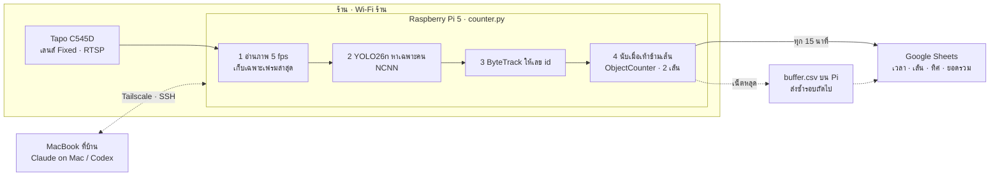

# แผนงาน: ระบบนับคนเดินผ่านหน้าร้าน (Tapo C545D → Google Sheets)

> ไฟล์นี้คือสเปกกลางของโปรเจกต์ ทั้ง Claude และ ChatGPT Codex อ่านและแก้ไฟล์นี้ใน repo เดียวกัน
> ไม่ต้องคัดลอกข้อความส่งไปมา ความคืบหน้ารายวันอยู่ที่ [STATUS.md](STATUS.md)

## ภาพรวมและเป้าหมาย

สคริปต์ Python ขนาดเล็กรันบน Raspberry Pi 5 ที่ตั้งไว้ในร้าน ดึงภาพจากเลนส์ Fixed ของ Tapo C545D ผ่าน Wi-Fi ร้าน
นับเฉพาะคนที่เดินข้ามเส้น 2 แนว (ทางเดินหน้าร้านและข้างร้าน) แล้วส่งยอดขึ้น Google Sheets ทุก 15 นาที
คุณ Eak ดูผลและสั่งงาน Pi จาก MacBook ที่บ้านผ่านอินเทอร์เน็ต

- นับเฉพาะคน: ไม่จดจำใบหน้า ไม่เก็บภาพหรือวิดีโอ ไม่แยกเพศหรืออายุ
- ความแม่นยำเป้าหมาย: อย่างน้อย 80% เมื่อเทียบกับการนับด้วยมือ
- ใช้โค้ดที่มีคนเขียนไว้แล้ว: `ObjectCounter` ของ Ultralytics ทำการตรวจจับ ติดตาม และนับคนข้ามเส้นให้ครบ
  เราเขียนเพิ่มแค่ส่วนต่อกล้อง กันหลุด และส่ง Google Sheets ราว 100–150 บรรทัด
- โมเดล: YOLO26n รุ่นเล็กสุด แปลงเป็นรูปแบบ NCNN ที่เร็วที่สุดบน Raspberry Pi
- ค่าใช้จ่ายเพิ่ม: Raspberry Pi 5 แรม 4GB, อะแดปเตอร์ 27W, พัดลม Active Cooler, microSD 64GB และเคส
  รวมประมาณ 4,000–5,500 บาท ซอฟต์แวร์ฟรีทั้งหมด
- สิ่งที่ไม่ทำ: ฐานข้อมูล, เว็บแดชบอร์ด, Docker (Google Sheets เก็บข้อมูลและทำกราฟได้เอง)

## สถาปัตยกรรมระบบ

ภาพจากกล้องถูกประมวลผลบน Raspberry Pi ในร้านแล้วทิ้งทันที สิ่งที่ออกจากร้านมีแค่ตัวเลขยอดนับทุก 15 นาที
ถ้าอินเทอร์เน็ตหลุด ยอดจะพักไว้ใน `buffer.csv` แล้วส่งตามทีหลัง ส่วน MacBook ที่บ้านใช้สั่งงานและแก้ไข Pi ผ่าน Tailscale

## ทำไมต้องวาง Raspberry Pi ไว้ที่ร้าน

กล้อง Tapo ส่งภาพ RTSP ได้เฉพาะเครื่องในวง Wi-Fi เดียวกัน และลงโปรแกรม VPN เองไม่ได้
ไลบรารีบน GitHub ที่ใช้กับ Tapo (go2rtc, pytapo) ก็ต้องรันในเครือข่ายเดียวกับกล้องเช่นกัน
จึงต้องมีเครื่องในร้าน หรือมีทางผ่านเข้าเครือข่ายร้าน

| ทางเลือก | ซื้อเพิ่ม | ข้อดี | ข้อเสีย |
| --- | --- | --- | --- |
| Raspberry Pi 5 นับที่ร้าน (แนะนำ) | ประมาณ 4,000–5,500 บาท | ภาพไม่ออกนอกร้าน ใช้เน็ตแค่ส่งตัวเลข, เปิดได้ตลอดเวลา กินไฟราว 10 วัตต์ | ต้องไปติดตั้งที่ร้าน 1 ครั้ง |
| โน้ตบุ๊กหรือคอมเก่าที่มีอยู่ นับที่ร้าน | 0 บาท | โค้ดเหมือนเดิมทุกอย่าง | กินไฟมากกว่า ต้องตั้งไม่ให้ sleep |
| VPN ของเราเตอร์ร้าน + MacBook ที่บ้านนับ | 0 บาท ถ้าเราเตอร์รองรับ | ไม่ต้องซื้อเครื่อง | ส่งวิดีโอตลอดเวลา กินเน็ตทั้งสองฝั่ง, MacBook ต้องเปิดและห้าม sleep ตลอดเวลาร้านเปิด |
| Port forwarding RTSP + MacBook ที่บ้านนับ | 0 บาท | ตั้งค่าง่าย | ไม่แนะนำ: ภาพและรหัส RTSP ไม่เข้ารหัส, เน็ตบางแพ็กเกจไม่ได้ IP จริง |

ทุกทางเลือกใช้โค้ดชุดเดียวกัน ต่างกันแค่ RTSP URL และเครื่องที่รัน

Pi 5 รันโมเดล YOLO26n แบบ NCNN ใช้เวลาประมาณ 67 มิลลิวินาทีต่อภาพ หรือราว 15 ภาพต่อวินาที
([Ultralytics: Raspberry Pi](https://docs.ultralytics.com/guides/raspberry-pi)) ขณะที่การนับคนเดินต้องการแค่ 5 ภาพต่อวินาที

## โค้ดโอเพนซอร์สที่นำมาใช้

| โปรเจกต์ | ใช้ทำอะไร | สถานะในงานนี้ |
| --- | --- | --- |
| [Ultralytics ObjectCounter](https://docs.ultralytics.com/guides/object-counting) | ตรวจจับ + ติดตาม + นับข้ามเส้น กำหนดเส้นด้วย 2 จุด และกรองเฉพาะคลาสคนได้ | แกนหลัก `pip install ultralytics` |
| [people-counter-yolox](https://github.com/slastrzelec/people-counter-yolox) | ตรรกะนับข้ามเส้นแบบ Python ล้วน พร้อมชุดทดสอบ | ตัวอย่างอ้างอิง |
| [cv-traffic-counter](https://github.com/vitormigli/cv-traffic-counter) | YOLO + ByteTrack อ่าน RTSP นับแยกทิศทาง | ตัวอย่างอ้างอิง |

Ultralytics ใช้สัญญาอนุญาต AGPL-3.0 ซึ่งใช้งานภายในร้านได้ตามปกติ เงื่อนไขเพิ่มเติมจะเกิดเมื่อนำไปขายหรือให้บริการแก่ผู้อื่น

## การแบ่งทีมและหน้าที่

| ทีม | บทบาท | งานที่ต้องส่ง | เฟส |
| --- | --- | --- | --- |
| Claude (claude.ai) | ผู้ออกแบบและผู้ตรวจ | PLAN.md, สเปก, รีวิวโค้ดผ่าน Pull Request, วิเคราะห์ผลทดสอบ | 4, 5, 6 |
| ChatGPT Codex | ผู้เขียนโค้ดหลัก | `counter.py`, `draw_lines.py`, `tests/`, `requirements.txt`, `foot-counter.service`, README | 4 |
| Claude on Mac | ผู้ติดตั้งและทดสอบจากระยะไกล | SSH เข้า Pi ผ่าน Tailscale, หาสตรีมเลนส์ Fixed, ติดตั้ง, แปลงโมเดล, ปรับจูน, ตั้งให้รันอัตโนมัติ | 3, 5, 6 |
| คุณ Eak | เจ้าของงานและผู้ตัดสินใจ | ซื้อและติดตั้ง Pi, Camera Account, Google Sheet + service account, นับมือเพื่อเทียบ, เลือกตำแหน่งเส้น, merge PR | 1, 2, 5, 6 |

**กติกาทำงานร่วมกันผ่าน GitHub** (รายละเอียดใน [AGENTS.md](../AGENTS.md))

1. ทุกคนอ่าน `docs/PLAN.md` และ `docs/STATUS.md` ก่อนเริ่มงาน
2. งานโค้ดทำใน branch ของตัวเอง แล้วเปิด Pull Request เข้า `main`
3. ทำเสร็จแล้วอัปเดต `docs/STATUS.md` ในคอมมิตเดียวกัน
4. คำถามหรือปัญหาที่ต้องให้อีกฝั่งดู เขียนเป็น GitHub Issue แทนการคัดลอกข้อความ

## ลำดับขั้นการทำงาน

ทั้งหมดประมาณ 2–3 วันทำงาน (รวมรอของ Pi) แต่ละเฟสมี "เสร็จเมื่อ" ที่ต้องผ่านก่อนไปเฟสถัดไป

1. **ซื้อและติดตั้ง Raspberry Pi ที่ร้าน** — คุณ Eak, ประมาณ 1 ชั่วโมง
    - ซื้อ Pi 5 แรม 4GB, อะแดปเตอร์ทางการ 27W, พัดลม Active Cooler, microSD 64GB, เคส
    - ใช้ Raspberry Pi Imager บน MacBook เขียน Raspberry Pi OS Lite 64-bit ลงการ์ด ตั้งชื่อเครื่อง, Wi-Fi ร้าน และเปิด SSH ไว้ล่วงหน้า
    - ที่ร้าน: วาง Pi ใกล้เราเตอร์ (ต่อสาย LAN ได้ยิ่งดี) แล้วติดตั้ง Tailscale บน Pi และ MacBook ด้วยบัญชีเดียวกัน
    - เสร็จเมื่อ: จาก MacBook ที่บ้าน `ssh` เข้า Pi ได้
2. **เตรียมกล้องและบัญชี** — คุณ Eak, ประมาณ 30 นาที
    - แอป Tapo → เลือกกล้อง → การตั้งค่า → Advanced Settings → Camera Account สร้างชื่อผู้ใช้และรหัสผ่าน (คนละชุดกับบัญชี Tapo)
    - ตั้ง IP คงที่ให้กล้องและ Pi ในเราเตอร์ร้าน (DHCP reservation)
    - สร้าง Google Sheet ชื่อ FootTraffic, สร้าง service account ใน Google Cloud ดาวน์โหลดไฟล์ key (.json) แล้วแชร์ชีตให้อีเมลของ service account เป็น Editor
    - เสร็จเมื่อ: มีชื่อผู้ใช้ รหัส IP กล้อง และไฟล์ key ครบ (เก็บไว้นอก repo)
3. **หาสตรีมของเลนส์ Fixed** — Claude on Mac ผ่าน SSH, ประมาณ 30 นาที
    - C545D มี 2 เลนส์ ต้องยืนยันว่า path ไหนคือภาพมุมกว้าง
    - เสร็จเมื่อ: ได้ RTSP path ที่ใช้จริง (บันทึกใน STATUS.md โดยไม่ใส่รหัสผ่าน), snapshot 1 ภาพ และวิดีโอตัวอย่าง 2 นาทีไว้บน MacBook
4. **เขียนโปรแกรม** — ChatGPT Codex, ประมาณ 1 ชั่วโมง
    - ทำตามสเปกในหัวข้อถัดไป ทดสอบกับวิดีโอตัวอย่างบน MacBook ก่อน
    - เสร็จเมื่อ: รันกับวิดีโอได้ ชุดทดสอบผ่าน และเปิด Pull Request แล้ว
5. **รีวิวและติดตั้งจริงบน Pi** — Claude รีวิว PR แล้ว Claude on Mac ติดตั้ง
    - Claude รีวิว PR บน GitHub แก้ตามที่พบ คุณ Eak merge แล้ว Claude on Mac `git pull` บน Pi แปลงโมเดลเป็น NCNN และวาดเส้นบน snapshot
    - เสร็จเมื่อ: แถวแรกขึ้นใน Google Sheet
6. **วัดความแม่นยำและรันถาวร** — คุณ Eak กับ Claude on Mac
    - นับมือเทียบ 2 ช่วง ปรับจูนจนถึง 80% แล้วตั้ง systemd ให้รันเองเมื่อเปิดเครื่องและกลับมาเองเมื่อหลุด
    - เสร็จเมื่อ: รันต่อเนื่อง 3 วันโดยไม่มีช่วงข้อมูลหาย

## สเปกโปรแกรม (สำหรับเฟส 4)

ไลบรารีที่ใช้ได้เท่านั้น: `ultralytics`, `opencv-python-headless`, `gspread`, `google-auth`, `pyyaml`, `python-dotenv`
เครื่องจริง: Raspberry Pi 5 4GB, Raspberry Pi OS 64-bit, Python 3.11 (ต้องรันทดสอบบน macOS ได้ด้วย)

**counter.py**
- อินพุต: RTSP URL จาก `.env` หรือไฟล์วิดีโอผ่าน `--source`
- อ่านภาพใน thread แยก เก็บเฉพาะเฟรมล่าสุดไม่ให้ค้างสะสม ประมวลผลประมาณ 5 fps
- โมเดล: `yolo26n_ncnn_model` บน Pi, `yolo26n.pt` บน Mac (เลือกจาก `config.yaml`)
- เส้นนับ 2 เส้นใน `config.yaml`: `front_aisle` และ `side_aisle` เป็นพิกัดสัดส่วน 0–1 แปลงเป็นพิกเซลตามขนาดภาพ
- ใช้ `solutions.ObjectCounter(model=..., region=<2 จุด>, classes=[0], show=False)` เส้นละ 1 ตัว
  - ถ้าวัดแล้วต่ำกว่า 4 fps บน Pi ให้เปลี่ยนเป็นเรียก `model.track` ครั้งเดียวต่อเฟรม (ByteTrack)
    แล้วใช้ฟังก์ชันตรวจข้ามเส้นของเราเองกับทั้ง 2 เส้น นับ 1 ครั้งต่อ id ต่อเส้น แยกทิศ
- อ่านยอด in/out สะสม แล้วคำนวณยอดที่เพิ่มขึ้นในแต่ละช่วง 15 นาที
- ทุก 15 นาที (เวลา Asia/Bangkok) append แถวใน Google Sheet: `timestamp, line, in, out, total`
- ส่งไม่สำเร็จเก็บใน `buffer.csv` แล้วส่งซ้ำรอบถัดไป
- RTSP หลุด: ลองต่อใหม่ทุก 10 วินาที ห้าม crash
- ห้ามบันทึกภาพหรือวิดีโอลงดิสก์ ยกเว้นโหมด `--debug` บน Mac ที่เปิดหน้าต่างแสดงกรอบและเส้น
- log ลง `counter.log` แบบหมุนไฟล์ ไม่ให้การ์ดเต็ม

**ไฟล์อื่น**
- `draw_lines.py`: เปิด snapshot ให้คลิก 2 จุดต่อเส้น แล้วบันทึกลง `config.yaml`
- `tests/`: ทดสอบการคำนวณยอดต่อช่วง และฟังก์ชันข้ามเส้นสำรอง (ข้าม, ไม่ข้าม, เดินกลับ, อยู่นอกช่วงเส้น)
- `requirements.txt`, `foot-counter.service` (systemd, `Restart=always`), README ภาษาไทย (ติดตั้ง รัน ทดสอบ)
- ห้ามมี: การจดจำใบหน้า ฐานข้อมูล เว็บเซิร์ฟเวอร์ Docker

## ทดสอบความแม่นยำ 80%

นับมือเทียบกับโปรแกรม 2 ช่วง ช่วงละ 15 นาที (ช่วงคนเยอะ เช่น 7:30–8:30 และช่วงบ่าย) แยกตามเส้น
ผ่านเมื่อทุกเส้นได้ค่าตั้งแต่ 0.80 ขึ้นไป

ความแม่นยำ = 1 − |P − M| / M โดย P = ยอดจากโปรแกรม, M = ยอดนับมือ
ตัวอย่าง นับมือ 50 คน โปรแกรมได้ 43 คน → 1 − 7/50 = 0.86

| อาการที่เจอ | สาเหตุที่น่าจะเป็น | ปรับอย่างไร |
| --- | --- | --- |
| นับขาดเยอะ | คนเดินซ้อนกัน หรือภาพเล็กไป | ลด conf เป็น 0.25, เพิ่มเป็น 8 fps, ลองใช้ stream1 |
| นับเกิน | id เปลี่ยนเมื่อคนถูกบัง | ย้ายเส้นไปจุดที่คนเดินเรียงทีละคนและไม่มีอะไรบัง, เพิ่มเกณฑ์ track ขั้นต่ำเป็น 5 เฟรม |
| นับพนักงานด้วย | เส้นพาดผ่านจุดที่พนักงานเดิน | ย้ายเส้นให้อยู่นอกเคาน์เตอร์ หรือยอมรับเป็นค่าคลาดเคลื่อนคงที่ |
| นับคนที่นั่งโต๊ะ | เส้นอยู่ใกล้โต๊ะ | ย้ายเส้นให้ห่างจากโต๊ะและเก้าอี้ |
| เครื่องร้อนหรือช้า | ประมวลผลถี่เกิน | ลดเหลือ 3–4 fps ซึ่งยังพอสำหรับคนเดิน |

## ข้อควรระวัง

- **เครื่องนับต้องอยู่ในเครือข่ายร้าน**: MacBook อยู่ที่บ้าน จึงใช้ Raspberry Pi นับที่ร้าน และใช้ MacBook สั่งงานผ่าน Tailscale (แผนส่วนตัวใช้ฟรี) โดยไม่ต้องเปิดพอร์ตเราเตอร์ร้าน
- **Path ของสตรีม**: Tapo ทั่วไปใช้ `/stream1` (ภาพชัด) และ `/stream2` (ภาพเล็ก) แต่ C545D มี 2 เลนส์ จึงต้องยืนยันในเฟส 3
  ([TP-Link: RTSP/ONVIF](https://www.tp-link.com/us/support/faq/2680/), [รายการ URL Tapo ของ iSpy](https://www.ispyconnect.com/camera/tapo))
- **ภาพเลนส์ตาปลา**: ขอบภาพบิดเบี้ยว ให้วางเส้นนับในช่วงกลางภาพ บนทางเดินที่คนเดินผ่านจริง
- **Pi ต้องมีพัดลมและไฟเสถียร**: ใช้ Active Cooler กับอะแดปเตอร์ 27W ของแท้ ถ้าไฟดับ Pi จะบูตและรันเองผ่าน systemd
- **ความลับไม่เข้า repo**: รหัสกล้อง, `.env` และไฟล์ key ของ service account ห้าม commit (มี `.gitignore` กันไว้แล้ว)
- **ความเป็นส่วนตัว**: โปรแกรมเก็บเฉพาะตัวเลข ไม่เก็บภาพ ควรติดป้ายแจ้งว่ามีกล้องวงจรปิดในร้านตามปกติ
- **ความแม่นยำ 80%** ทำได้จริงกับมุมกล้องแบบนี้ แต่ช่วงคนแน่นมากอาจตกลง ควรดูแนวโน้มรายวันมากกว่าตัวเลขรายนาที
