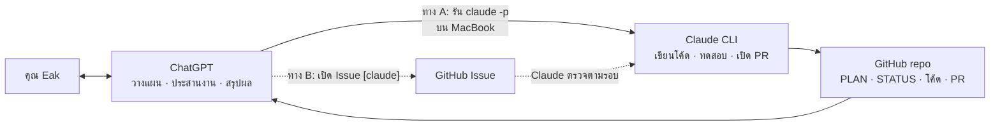

# วิธีทำงานร่วมกัน: ChatGPT วางแผน · Claude เขียนโค้ด

คุณ Eak คุยกับ ChatGPT เพียงที่เดียว ChatGPT เป็นผู้วางแผนและผู้ประสานงาน แล้วสั่ง Claude ให้เขียนโค้ด
ข้อมูลทั้งหมดอยู่ใน repo นี้ จึงไม่ต้องคัดลอกข้อความระหว่างแชต



## หน้าที่

| ใคร | ทำอะไร | ไม่ทำอะไร |
| --- | --- | --- |
| ChatGPT | แตกงานจาก `docs/PLAN.md`, สั่ง Claude, อ่านผลแล้วสรุปให้คุณ Eak, อัปเดตเรื่องที่รอตัดสินใจใน `docs/STATUS.md` | ไม่ merge PR เอง, ไม่ใส่รหัสผ่านในคำสั่งหรือ Issue |
| Claude | เขียนโค้ดตามสเปก, รันทดสอบ, เปิด Pull Request, อัปเดต `docs/STATUS.md`, ทักท้วงถ้าแผนทำไม่ได้จริง | ไม่ push เข้า `main` ตรง ๆ, ไม่ merge PR |
| คุณ Eak | ตัดสินใจ, กด merge PR, งานหน้าร้าน (Pi, กล้อง, บัญชี Google) | |

ถ้า Claude เห็นว่าแผนส่วนไหนทำไม่ได้หรือมีทางที่ง่ายกว่า ให้เขียนเหตุผลในคำอธิบาย PR หรือใน Issue แล้วให้ ChatGPT นำไปถามคุณ Eak

## ทาง A (แนะนำ): ChatGPT สั่ง Claude CLI บน MacBook

ใช้ได้เมื่อ ChatGPT ที่ใช้อยู่รันคำสั่งในเทอร์มินัลบน MacBook ได้ (เช่น Codex ในแอป ChatGPT บน Mac) ได้ผลทันที ไม่ต้องรอรอบ

**ติดตั้งครั้งเดียวบน MacBook**
1. ติดตั้ง Claude Code แล้วพิมพ์ `claude` หนึ่งครั้งเพื่อล็อกอินด้วยบัญชี Claude
2. ติดตั้ง GitHub CLI แล้ว `gh auth login` เพื่อให้ Claude เปิด Pull Request ได้
3. `git clone https://github.com/Eak-dev/Foot-traffic-counter.git ~/Foot-traffic-counter`

**คำสั่งที่ ChatGPT ใช้สั่งงาน** (รันในโฟลเดอร์ repo)

```bash
cd ~/Foot-traffic-counter
git switch main && git pull

claude -p "งาน: <อธิบายงาน> อ่าน AGENTS.md และ docs/PLAN.md ก่อน ทำใน branch ใหม่ รันทดสอบ แล้วเปิด Pull Request สรุปสิ่งที่ทำเป็นภาษาไทย" \
  --permission-mode acceptEdits \
  --allowedTools "Bash(git *),Bash(gh pr *),Bash(gh issue *),Bash(python *),Bash(python3 *),Bash(pip *),Bash(pytest *)" \
  --output-format json
```

- ผลลัพธ์เป็น JSON: ข้อความสรุปอยู่ในช่อง `result` และรหัสบทสนทนาอยู่ในช่อง `session_id`
- ถามต่อในบทสนทนาเดิม: `claude -p "<คำถามต่อ>" --resume <session_id> --output-format json`
- `--permission-mode acceptEdits` ให้ Claude แก้ไฟล์ได้เอง ส่วนคำสั่งเทอร์มินัลอนุญาตเฉพาะที่ระบุใน `--allowedTools`
- ไม่ใช้ `--bare` เพราะโหมดนั้นข้าม CLAUDE.md และต้องใช้ API key แยก
- อ้างอิง: [Run Claude Code programmatically](https://code.claude.com/docs/en/headless)

**งานที่ต้องเข้า Raspberry Pi ที่ร้าน** ให้เพิ่ม `Bash(ssh *),Bash(scp *)` ใน `--allowedTools` และระบุชื่อเครื่อง Tailscale ในคำสั่ง

## ทาง B (สำรอง): สั่งงานผ่าน GitHub Issue

ใช้เมื่อ MacBook ปิดอยู่ หรือ ChatGPT รันคำสั่งบนเครื่องไม่ได้ ช้ากว่าทาง A เพราะ Claude ตรวจตามรอบเวลา

1. ChatGPT เปิด Issue ด้วยแม่แบบ "งานสำหรับ Claude" หัวข้อขึ้นต้นด้วย `[claude]`
2. Claude ตรวจ Issue ที่เปิดอยู่ตามรอบ ทำงานแล้วเปิด Pull Request และตอบกลับใน Issue
3. ChatGPT อ่านคำตอบและ PR ผ่านปลั๊กอิน GitHub แล้วสรุปให้คุณ Eak

> สถานะ: ยังไม่ได้ตั้งรอบตรวจอัตโนมัติ ต้องการใช้เมื่อไรให้บอก Claude ใน claude.ai

## กติกาเขียนคำสั่งงาน (ใช้ทั้งทาง A และ B)

- งานละ 1 เรื่อง ระบุไฟล์ที่เกี่ยวข้องและ "เสร็จเมื่อ" ให้ชัด
- อ้างหัวข้อใน `docs/PLAN.md` แทนการเขียนสเปกซ้ำ
- ห้ามใส่รหัสกล้อง, `.env` หรือไฟล์ key ในคำสั่งหรือ Issue
